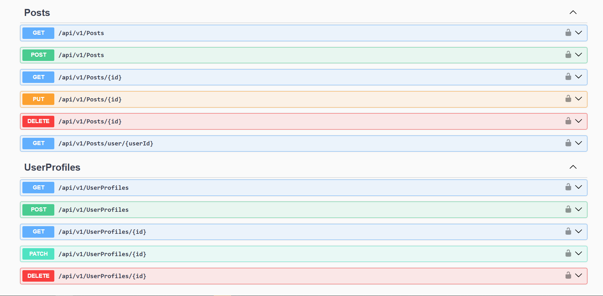

#  Social Media API

> A social media API built with .NET 8, Clean Architecture, and CQRS pattern

##  Architecture

This project follows **Clean Architecture** principles with clear separation of concerns:

###  Layer Responsibilities

####  **Presentation Layer** (`Social.Api`)
- Controllers and API endpoints
- Request/Response DTOs
- API routing and versioning
- AutoMapper profiles

####  **Application Layer** (`Social.Application`)
- Business logic and use cases
- Commands and Queries
- Command and Query Handlers
- Application services
- Validation rules

####  **Domain Layer** (`Social.Domain`)
- Domain models and aggregates
- Business rules 


####  **Infrastructure Layer** (`Social.DAL`)
- Database context and configurations
- Entity Framework setup
- Data access implementations
- External service integrations

##  API Documentation

The API is fully documented with Swagger/OpenAPI. Here's a preview of the available endpoints:




```
📁 SocialMedia/
├── 📁 Social.Api/                
│   ├── 📁 Controllers/V1/         
│   │   ├── PostsController.cs
│   │   ├── PostCommentsController.cs
│   │   ├── PostInteractionsController.cs
│   │   └── UserProfilesController.cs
│   ├── 📁 Contracts/              
│   │   └── 📁 Posts/
│   │       ├── 📁 Requests/
│   │       └── 📁 Responses/
│   ├── 📁 Extensions/
│   ├── 📁 MappingProfiles/       
│   └── 📁 Registers/              
│
├── 📁 Social.Application/       
│   ├── 📁 Posts/                  
│   │   ├── 📁 Commands/
│   │   ├── 📁 Queries/
│   │   ├── 📁 CommandHandlers/
│   │   └── 📁 QueryHandlers/
│   ├── 📁 PostComments/          
│   ├── 📁 PostInteractions/       
│   ├── 📁 UserProfiles/           
│   ├── 📁 Models/                 
│   └── 📁 Enums/                  
│
├── 📁 Social.Domain/              
│   └── 📁 Aggregates/
│       ├── 📁 PostAggregate/
│       │   ├── Post.cs
│       │   ├── PostComment.cs
│       │   └── PostInteraction.cs
│       └── 📁 UserProfileAggregate/
│           └── UserProfile.cs
│
└── 📁 Social.DAL/                 
    ├── DataContext.cs          
    └── 📁 Configurations/         
        ├── PostConfig.cs
        ├── PostCommentConfig.cs
        ├── PostInteractionConfig.cs
        └── UserProfileConfig.cs
```

##  Features

###  User Management
- User profile creation and management
- Profile information updates
- User authentication and authorization

###  Posts Management
- Create, read, update, delete posts
- Photo upload support for posts
- Rich text content support
- User-specific post filtering

###  Comments System
- Add comments to posts
- Edit and delete comments

###  Interactions & Reactions
- Like, Love, Haha, Wow, Sad, Angry reactions
- Interaction management (add/remove)
- Interaction analytics and summaries
- User interaction history


